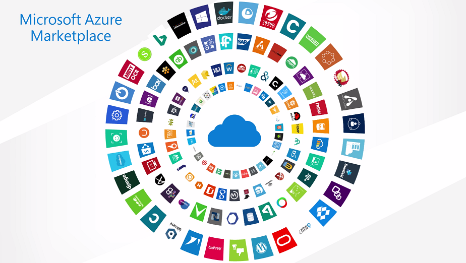
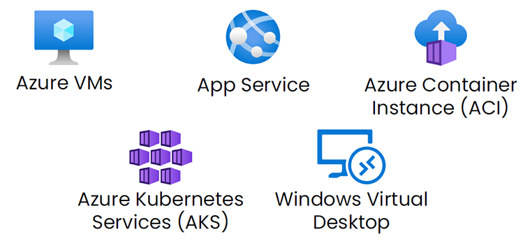
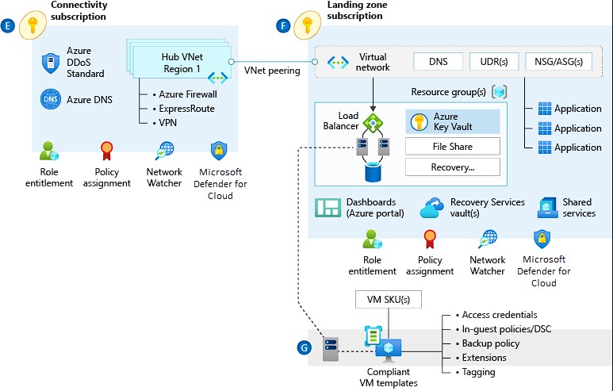
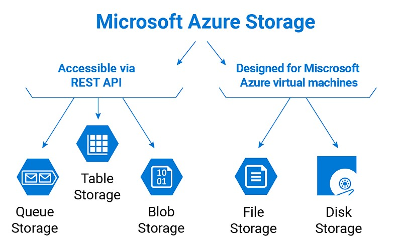
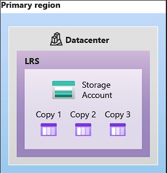
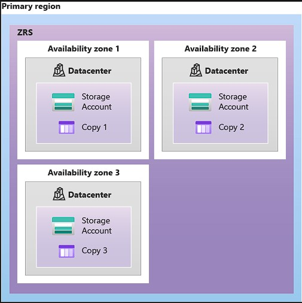
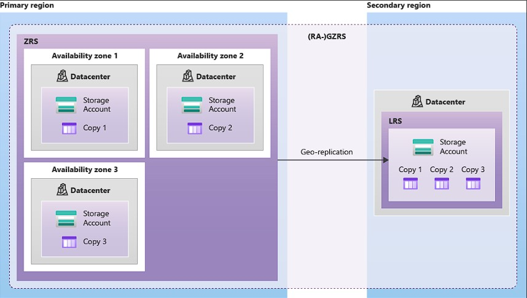
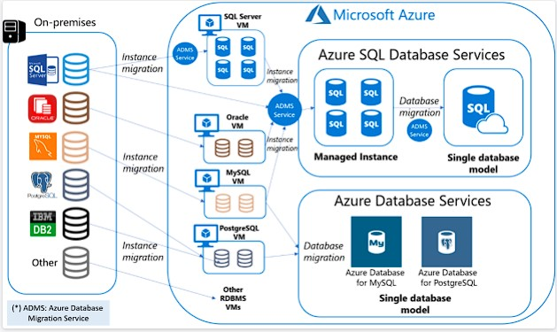
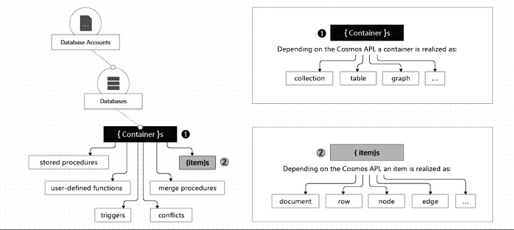

<h1><a name="readme-top"></a></h1>

[](https://github.com/marcossilvestrini/learning-az-900/actions/workflows/powershell.yml)
[](https://github.com/marcossilvestrini/learning-az-900/actions/workflows/release.yml)

[![MIT License][license-shield]][license-url]
[![Forks][forks-shield]][forks-url]
[![Stargazers][stars-shield]][stars-url]
[![Contributors][contributors-shield]][contributors-url]
[![Issues][issues-shield]][issues-url]
[![LinkedIn][linkedin-shield]][linkedin-url]

# LEARNING AZ-900


<p align="center">
<strong>Explore the docs »</strong></a><br />
    <a href="https://marcossilvestrini.github.io/learning-az-900/">Main Page</a>
    -
    <a href="https://github.com/marcossilvestrini/learning-az-900">Code Page</a>
    -
    <a href="https://github.com/marcossilvestrini/learning-az-900/issues">Report Bug</a>
    -
    <a href="https://github.com/marcossilvestrini/learning-az-900/issues">Request Feature</a>
</p>

## Summary

<details>
  <summary><b>TABLE OF CONTENT</b></summary>
  <ol>
    <li>
      <a href="#about-the-project">About The Project</a>
    </li>
    <li>
      <a href="#getting-started">Getting Started</a>
      <ul>
        <li><a href="#prerequisites">Prerequisites</a></li>
        <li><a href="#installation">Installation</a></li>
      </ul>
    </li>
    <li><a href="#usage">Usage</a></li>
    <li><a href="#roadmap">Roadmap</a></li>
    <li><a href="#cloud-azure">Cloud in Azure</a>
    <li><a href="#azure-marketplace">Azure Marketplace</a>
    <li><a href="#azure-pricing">Azure Pricing</a>
    <li><a href="#azure-subscription">Azure Subscription</a>
    <li><a href="#azure-support">Azure Support</a>
    <li><a href="#azure-compute">Azure Compute Services</a>
    <li><a href="#azure-network">Azure Compute Services</a>
    <li><a href="#azure-storage">Azure Compute Services</a>
        <li><a href="#azure-database">Azure Compute Services</a>
    <li><a href="#azurecli">Azure CLI</a>
    <li><a href="#license">License</a></li>
    <li><a href="#contact">Contact</a></li>
    <li><a href="#acknowledgments">Acknowledgments</a></li>
  </ol>
</details><br>

<a name="about-the-project"></a>

## About Project

>This project aims to help students or professionals to learn the main concepts of AZ-900 exam

<p align="right">(<a href="#readme-top">back to top</a>)</p>

<a name="getting-started"></a>

## Getting Started

This is an example of how you may give instructions on setting up your project locally.
To get a local copy up and running follow these simple example steps.

<a name="prerequisites"></a>

### Prerequisites

This is an example of how to list things you need to use the software
and how to install them.

* git
* Virtual Box and extension
* Vagrant

<a name="installation"></a>

### Installation

Clone the repo

```sh
git clone https://github.com/marcossilvestrini/learning-az-900.git
```

<a name="usage"></a>

## Usage

Use this repository for get learning about AZ-900 exam

<p align="right">(<a href="#readme-top">back to top</a>)</p>

<a name="roadmap"></a>

## Roadmap

* [x] Create repository
* [x] Create examples about Exam
* [x] Create github action for automation tasks
* [x] Upload simulated itexam

<p align="right">(<a href="#readme-top">back to top</a>)</p>

## About Cloud in Azure

<a name="cloud-azure"></a>

<https://www.crayon.com/ro/resources/news2/azure-iaas-paas-saas--whats-the-difference>

### Infrastructure as a Service (IaaS)

IaaS is the first layer of cloud services covering the fundamental infrastructure on which all other computing factors are built, hence, replacing the hardware. Instead of buying it, you rent IT infrastructure servers and virtual machines (VMs), storage, networks, and operating systems from Microsoft on a pay-as-you-go basis.

Infrastructure is the backbone that supports a computer system, the servers and storage, networks, security, and data centers. Traditionally, these aspects of computing would be the responsibility of an organization’s own IT department, housed and managed under its own roof but with IaaS, organizations now have the option to have a vendor provide and manage these things on their end.

#### IaaS on Azure

With Azure’s IaaS offering you outsource all your network and computing needs to Microsoft, removing all infrastructure from your own servers and basing it all at Microsoft’s end. All infrastructure is managed on your behalf, leaving you to purchase, install, configure, and operate the software that runs on it, such as operating systems, apps, and middleware.

Azure offers a massive range of IaaS facilities depending on the needs of your business, from compute and networking to security and storage, including Container Service and Virtual Machines through which you can host websites, store and backup data, develop and test environments, build web apps, and run high-performance computing.

Main benefit is that organizations that use IaaS have more freedom to access an IT environment that suits their needs and can customize it as they want in a matter of “mouse clicks” without losing time to purchase, install and configure physical servers or hardware. It also enables companies to get rid of the hassle of having to operate infrastructure and hardware of their own.

### Platform as a Service (PaaS)

A PaaS solution is the middle layer, requiring less user management without access to the operating system. PaaS gives businesses the digital platform to develop and deploy their own apps and services, without the need to maintain server space, programming software, and security protocols internally.

It is faster, cheaper, and simpler for businesses to build their products and services, and scale their resources as needed without significant financial impact if they choose PaaS.

#### PaaS on Azure

If you choose PaaS on Azure, you will find plenty of services to help you implement a cloud-powered development platform. App Services, Azure Search, and Azure CDN, Azure will offer everything you need to deliver cloud applications on a pay-as-you-go basis, from the smallest web apps to enterprise-level software.

Azure’s PaaS offerings give developers total control over their application, allowing them the freedom to work on building, safe in the knowledge that things like operating system patches or load balancing will just work. With services like Azure Functions, businesses can take advantage of PaaS power without having to worry about server configuration or scaling, which is automatic.

### Software as a Service (SaaS)

A SaaS solution requires the least management, Microsoft being responsible for managing everything, while you just use the software. Software is delivered via the internet, rather than being downloaded onto individual devices. and you are responsible for configuring the SaaS solution such as Outlook email, calendar, and office tools (such as Microsoft Office 365).

With SaaS, every aspect of the software’s hosting, setup, and maintenance is handled by its vendor. Also, all your data, files, and usage history is stored at the vendor’s end, within a multi-tenancy cloud. As a result, the software is accessible from anywhere, on any device, and data is always backed up to a centralized location. Don’t worry, your information can’t be seen or accessed by other software users.

All you need to do to access it is log in to an app or browser and use the software in the same way as you would a traditional desktop application installed on your own computer.

#### SaaS on Azure

Main SaaS offerings on Azure are products like Dynamics 365, Outlook, and Office 365 are all built and hosted on Azure. Azure can be also used both to host apps you’ve created yourself, beside accessing other Microsoft SaaS services.

One major benefit of using Azure as a foundation for your SaaS apps is that it lets you take advantage of powerful technology and intelligent tools like analytics and machine learning.

### Azure Global Infrastructure

<https://datacenters.microsoft.com/globe/explore>

* Geographic
  * Region
    * Availability Zone


<p align="right">(<a href="#cloud-azure">back to cloud azure</a>)</p>
<p align="right">(<a href="#readme-top">back to top</a>)</p>

## Azure Marketplace

<a name="azure-marketplace"></a>


https://learn.microsoft.com/en-us/marketplace/azure-marketplace-overview

Azure Marketplace is an online store that contains thousands of IT software applications and services built by industry-leading technology companies. In Azure Marketplace you can find, try, buy, and deploy the software and services you need to build new solutions and manage your cloud infrastructure

<p align="right">(<a href="#azure-marketplace">back to cloud azure-marketplace</a>)</p>
<p align="right">(<a href="#readme-top">back to top</a>)</p>

## Azure Pricing

<a name="azure-pricing"></a>
https://azure.microsoft.com/en-us/pricing/

### Compute

* Pay as you go
* Reserved
* Spot

### OS\Services License

* Included
* Pay as you go
* Azure Hybrid Benefic

Example of Plain Migration


<p align="right">(<a href="#azure-pricing">back to cloud azure-pricing</a>)</p>
<p align="right">(<a href="#readme-top">back to top</a>)</p>

## Azure Subscriptions

<a name="azure-subscription"></a>

<https://www.alifconsulting.com/post/understand-azure-resource-organization-in-multitenant-solutions>


<p align="right">(<a href="#azure-subscriptions">back to cloud azure-subscriptions</a>)</p>
<p align="right">(<a href="#readme-top">back to top</a>)</p>

## Azure Support Plains

<a name="azure-support"></a>


<p align="right">(<a href="#azure-support">back to cloud azure-support</a>)</p>
<p align="right">(<a href="#readme-top">back to top</a>)</p>

## Azure Compute Services

<a name="azure-compute"></a>


https://learn.microsoft.com/en-us/azure/architecture/guide/technology-choices/compute-decision-tree

### Some Important Features of Azure Compute

* Virtual Machine Scale Set
* Azure Functions

<p align="right">(<a href="#azure-compute">back to azure-compute</a>)</p>
<p align="right">(<a href="#readme-top">back to top</a>)</p>

<a name="azure-network"></a>

## Azure Network



### Some Important Features of Azure Network

* Virtual Network
* Load Balance
* VPN Gateway
* Application Gateway
* Express Route
* Content Delivery Network

<p align="right">(<a href="#azure-network">back to azure-compute</a>)</p>
<p align="right">(<a href="#readme-top">back to top</a>)</p>

<a name="azure-storage"></a>

## Azure Storage



### Azure Storage redundancy

#### Locally redundant storage



#### Zone-redundant storage



#### Geo-redundant storage


#### Geo-zone-redundant storage



### Some Important Features of Azure Storage

* Blob
* Disk
* File
* Archive
* Table
* Access Tiers
  * Hot
  * Coll
  * Archive

<p align="right">(<a href="#azure-storage">back to azure-compute</a>)</p>
<p align="right">(<a href="#readme-top">back to top</a>)</p>

## Azure Database



### Some Important Features of Azure Database

* Cosmos DB
* Azure SQL
* MySQL
* PostgreSQL
* Database Migration Service

### Elements in an Azure Cosmos DB account


https://learn.microsoft.com/en-us/azure/cosmos-db/resource-model

<p align="right">(<a href="#azure-database">back to azure-compute</a>)</p>
<p align="right">(<a href="#readme-top">back to top</a>)</p>

<a name="azure-storage"></a>

## Azure Storage

## Azure CLI

<a name="azurecli"></a>

### Install

Windows

```powershell
winget install -e --id Microsoft.AzureCLI
```

Linux

```sh
#https://learn.microsoft.com/en-us/cli/azure/install-azure-cli-linux?pivots=dnf

# Debian
curl -sL https://aka.ms/InstallAzureCLIDeb | sudo bash

# RPM

## Import the Microsoft repository key.
sudo rpm --import https://packages.microsoft.com/keys/microsoft.asc

## RHEL 9 or CentOS Stream 9
sudo dnf install -y https://packages.microsoft.com/config/rhel/9.0/packages-microsoft-prod.rpm

##  RHEL 8 or CentOS Stream 8
sudo dnf install -y https://packages.microsoft.com/config/rhel/8/packages-microsoft-prod.rpm

## Install package
sudo dnf install azure-cli
```

### Important Commands

```powershell

# login account
az login

# list management groups
az account management-group list

# list subscriptions \ accounts
az account list

# create subscription
az account create

# list resources
az resource list
az resource list --location 'eastus'
az resource list --location 'eastus'

# list resource groups
az group list

# create resource group
az group create --location eastus --resource-group testazurecli

# delete resource group
az group delete --resource-group testazurecli
az group delete -y --resource-group testazurecli

# list virtual machines
az vm list  --resource-group labs
az vm show  --resource-group labs  --name 'lab-az900'

# create virtual machine
az vm create `
--resource-group $groupName `
--image $image `
--name $vmName `
--computer-name $vmName `
--priority $priority `
--admin-username $adminUsername  `
--admin-password $adminPassword `
--generate-ssh-keys `
--authentication-type 'all' 

# get vm public ip 
az vm list-ip-addresses -g labs -n lab-az900

```

<p align="right">(<a href="#azurecli">back to azure cli</a>)</p>
<p align="right">(<a href="#readme-top">back to top</a>)</p>

## Contributing

Contributions are what make the open source community such an amazing place to
learn, inspire, and create. Any contributions you make are **greatly appreciated**.

If you have a suggestion that would make this better, please fork the repo and
create a pull request. You can also simply open an issue with the tag "enhancement".
Don't forget to give the project a star! Thanks again!

1. Fork the Project
2. Create your Feature Branch (`git checkout -b feature/AmazingFeature`)
3. Commit your Changes (`git commit -m 'Add some AmazingFeature'`)
4. Push to the Branch (`git push origin feature/AmazingFeature`)
5. Open a Pull Request

## License

* This project is licensed under the MIT License * see the LICENSE.md file for details

## Contact

Marcos Silvestrini - marcos.silvestrini@gmail.com \
[](https://twitter.com/mrsilvestrini)

Project Link: [https://github.com/marcossilvestrini/learning-az-900](https://github.com/marcossilvestrini/learning-az-900)

<p align="right">(<a href="#readme-top">back to top</a>)</p>

## Acknowledgments

* [Azure Certification details](https://learn.microsoft.com/en-us/certifications/azure-fundamentals/)
* [Azure Portal](https://portal.azure.com/)
* [Azure Pricing](https://azure.microsoft.com/en-us/pricing/)
* [Support Plains](https://azure.microsoft.com/en-us/support/plans/)
* [Azure CLI](https://learn.microsoft.com/en-us/cli/azure/get-started-with-azure-cli)
* [Create Service Principal](https://learn.microsoft.com/en-us/cli/azure/create-an-azure-service-principal-azure-cli)
* [AWS to Azure services comparison](https://learn.microsoft.com/en-us/azure/architecture/aws-professional/services)
* [Azure VM Size](https://docs.microsoft.com/pt-br/azure/virtual-machines/sizes)
* [Alura Course](https://www.alura.com.br/formacao-certificacao-az-900-microsoft-azure-fundamentals)
* [Simulated](https://www.itexams.com/exam/AZ-900)
* [Azure Cli Query](https://www.thorsten-hans.com/master-azure-cli-queries-the-missing-manual/)

<p align="right">(<a href="#readme-top">back to top</a>)</p>

<!-- MARKDOWN LINKS & IMAGES-->
<!-- https://www.markdownguide.org/basic-syntax/#reference-style-links -->
[contributors-shield]: https://img.shields.io/github/contributors/marcossilvestrini/learning-az-900.svg?style=for-the-badge
[contributors-url]: https://github.com/marcossilvestrini/learning-az-900/graphs/contributors
[forks-shield]: https://img.shields.io/github/forks/marcossilvestrini/learning-az-900.svg?style=for-the-badge
[forks-url]: https://github.com/marcossilvestrini/learning-az-900/network/members
[stars-shield]: https://img.shields.io/github/stars/marcossilvestrini/learning-az-900.svg?style=for-the-badge
[stars-url]: https://github.com/marcossilvestrini/learning-az-900/stargazers
[issues-shield]: https://img.shields.io/github/issues/marcossilvestrini/learning-az-900.svg?style=for-the-badge
[issues-url]: https://github.com/marcossilvestrini/learning-az-900/issues
[license-shield]: https://img.shields.io/github/license/marcossilvestrini/learning-az-900.svg?style=for-the-badge
[license-url]: https://github.com/marcossilvestrini/learning-az-900/blob/master/LICENSE
[linkedin-shield]: https://img.shields.io/badge/-LinkedIn-black.svg?style=for-the-badge&logo=linkedin&colorB=555
[linkedin-url]: https://linkedin.com/in/marcossilvestrini
